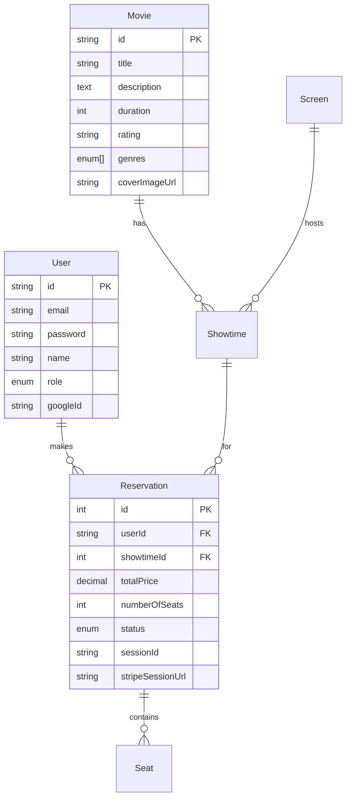

# 🎬 Cinema Booking System

A full-featured movie theater reservation system built with **NestJS**, **TypeScript**, and **MySQL**. This enterprise-grade application handles everything from user authentication to payment processing and comprehensive reporting.

## 🚀 Live Demo & Features

### Core Features
- 🔐 **Multi-Auth System**: JWT + Google OAuth2 integration
- 🎫 **Smart Seat Management**: Real-time availability with conflict prevention
- 💳 **Stripe Payment Integration**: Secure checkout with webhook handling
- 📊 **Admin Dashboard**: Comprehensive analytics and reporting
- 🎭 **Movie Management**: Full CRUD with image upload to cloud storage
- 🏢 **Screen Management**: Multi-screen theater support
- ⏰ **Showtime Scheduling**: Automated conflict detection
- 🔄 **Reservation Lifecycle**: Pending → Confirmed → Refund flow

## 🛠 Tech Stack

### Backend
- **Framework**: NestJS (Node.js)
- **Language**: TypeScript
- **Database**: MySQL with TypeORM
- **Authentication**: Passport.js (JWT + Google OAuth)
- **Payments**: Stripe API
- **File Storage**: AWS S3 + Vercel Blob
- **Validation**: Class-validator & Class-transformer

### Infrastructure
- **Containerization**: Docker + Docker Compose
- **Database**: MySQL 8.0
- **Environment**: Production-ready configuration

## 📋 Key Architecture Highlights

### 🎯 Domain-Driven Design
```
src/
├── auth/           # Authentication & authorization
├── movies/         # Movie management
├── showtimes/      # Schedule management
├── reservations/   # Booking system
├── screens/        # Theater management
├── reporting/      # Analytics & insights
└── stripe/         # Payment processing
```

### 🔒 Security Features
- **Role-based access control** (User/Admin)
- **JWT token authentication** with refresh mechanism
- **Input validation** with DTO classes
- **SQL injection prevention** via TypeORM
- **CORS enabled** for cross-origin requests

### 💡 Business Logic Highlights
- **Seat conflict prevention** with database-level constraints
- **Payment session management** with 30-minute expiration
- **Automated refund processing** with business rules
- **Real-time seat availability** checking
- **Revenue tracking** and performance analytics

## 🏗 System Design

### Database Schema


### Payment Flow
1. **Reservation Creation** → Pending status
2. **Stripe Checkout** → 30-minute session
3. **Webhook Processing** → Status update
4. **Seat Lock/Release** → Based on payment result

## 🚦 Getting Started

### Prerequisites
- Node.js 18+
- Docker & Docker Compose
- MySQL 8.0

### Quick Start
```bash
# Clone the repository
git clone <repository-url>
cd movie-app

# Environment setup
cp .env.example .env
# Configure your environment variables

# Start with Docker
docker-compose up -d

# Or run locally
npm install
npm run start:dev
```

### Environment Variables
```env
# Database
HOST=localhost
PORT=3306
DATABASE=mydatabase
databasename=user
PASSWORD=password

# Authentication
JWT_SECRET=your-secret-key
GOOGLE_CLIENT_ID=your-google-client-id
GOOGLE_CLIENT_SECRET=your-google-secret

# Payments
STRIPE_SECRET_KEY=sk_test_...
STRIPE_WEBHOOK_SECRET=whsec_...

# Storage
AWS_ACCESS_KEY_ID=your-access-key
AWS_SECRET_ACCESS_KEY=your-secret-key
```


## 💳 Payment Integration

### Stripe Webhook Handling
```typescript
@Post('/stripe-webhook')
async handleStripeWebhook(@Req() request, @Res() response) {
  const event = Stripe.webhooks.constructEvent(
    request.rawBody,
    signature,
    this.endpointSecret,
  );

  switch (event.type) {
    case 'checkout.session.completed':
      await this.confirmReservation(sessionData);
      break;
    case 'checkout.session.expired':
      await this.expireReservation(sessionData);
      break;
  }
}
```

## 📈 Performance Features

- **Database Indexing**: Optimized queries for high-traffic scenarios
- **Connection Pooling**: Efficient database connection management
- **Validation Pipeline**: Early request validation to prevent processing overhead
- **Transaction Management**: ACID compliance for critical operations
- **Caching Strategy**: Structured for Redis integration


## 🚀 Deployment Ready

### Docker Configuration
- **Multi-stage builds** for optimized images
- **Health checks** for service monitoring  
- **Volume persistence** for database
- **Environment-based configuration**

### Production Considerations
- **Error handling** with proper HTTP status codes
- **Logging** with structured format
- **CORS** configuration for frontend integration
- **Rate limiting** ready for implementation
- **Database migrations** with TypeORM

## 📖 Business Rules Implemented

### Reservation Logic
- ✅ No double-booking of seats
- ✅ 30-minute payment window
- ✅ Refunds only before showtime (15min buffer)
- ✅ Automatic seat release on payment failure

### Admin Features
- ✅ Movie management with image upload
- ✅ Screen configuration and capacity
- ✅ Showtime scheduling with conflict detection
- ✅ Financial reporting and analytics
- ✅ User management and role assignment

## 🎯 Technical Decisions & Rationale

### Why NestJS?
- **Enterprise-grade architecture** with dependency injection
- **Built-in validation** and transformation pipes
- **Decorator-based approach** for clean, readable code
- **Excellent TypeScript support** with strong typing

### Why TypeORM?
- **Database abstraction** with multiple DB support
- **Migration management** for schema evolution
- **Relationship handling** with lazy loading
- **Query builder** for complex operations

## 🤝 Contributing

This project demonstrates:
- **Clean Architecture** principles
- **SOLID** design patterns
- **Test-driven development** approach
- **API-first** design methodology
- **Production-ready** code quality


---

*Built with ❤️ using modern technologies and best practices*